# How a Bill Becomes a Law

I've been thinking about what it would look like to automate the process of passing laws in the US so I decided to map out the whole process. Then it got complicated, so I decided to start with just how a Bill would get through the House of Representatives.

> **Note:** This is a joke, and probably will be removed for the final version, but I'm not wrong here.
>
> I might add the senate, but it would be hard not to do this:
>
> 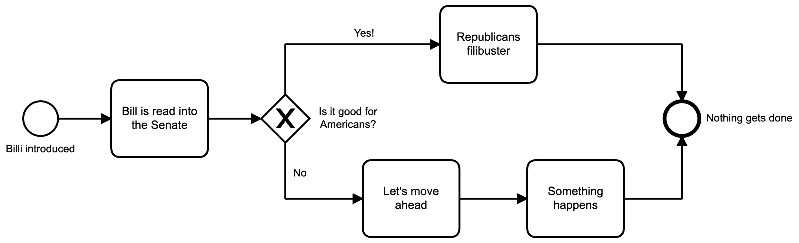
>
> I kid ... or do I?

It turns out that the process of moving a Bill through the US House of Representatives is pretty complicated.

## What we may already know

Now, if you grew up in the US during a certain time, this may be familiar to you. It was put out by Schoolhouse Rock.

## There's more to it, of course

The basic idea is that a bill is introduced into Congress (in this case, the House of Representatives). Once it's introduced, the House decides if it will go to a Committee or a Sub-Committee for discussion, debate, and what's called 'mark-up'. That's where the committee members make changes to the wording of the bill, etc.

Finally, the committee or sub-committee will vote on the bill. If it passes, it moves on to the next step. If the vote fails, the bill is dead and the whole process ends.

If the bill passes the sub-committee and the committee, it is then brought to the full House for debate. Once the full House has had a chance to read the Bill, and have a debate on it, it is put to a vote by the full House.

If it passes the House, it is sent to the Senate where the whole process starts over again.

> **Note:** If a Bill is introduced in the Senate, and makes it all the way through the Senate, the Bill then comes to the House, where it is subjected to the entire process above.

That's really the overly-simplified version.

## Mapping out the process

As with any process, it can be instructive to map the whole thing out so that you can see all the various steps involved in completing it. That's when I realized that things are actually a bit more complicated. There are all sorts of ways in which the process can end.

Here's a simplified flowchart of the process:

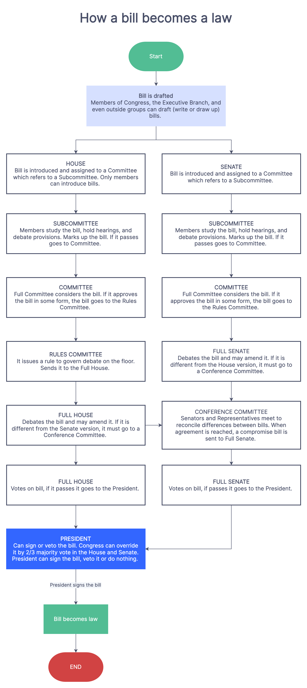 courtesy of [zen flowcharts](https://www.zenflowchart.com/guides/how-a-bill-becomes-a-law-flowchart)

There are a lot of these flowcharts out there, but none of then are actually executable, so I decided to make that happen.

## An executable flowchart

Using the other flowcharts and information, I mapped out the entire process of a Bill getting through the US House of Representatives and here it is:

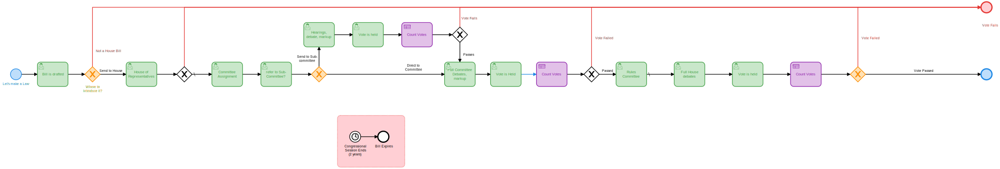

There are a *lot* of User Tasks in there, which means I needed a lot of forms for users to fill out. Thankfully there is an integrated Form Builder in C8, which I used to design the various forms.

I can now deploy this process, and then start an instance of it to see how it all works. This is actually an important point here. These are not just diagrams or flowcharts, but they are also processes that can be directly executed.

When I deploy and start this process I can go to the Operate tab and see the progress of the process.

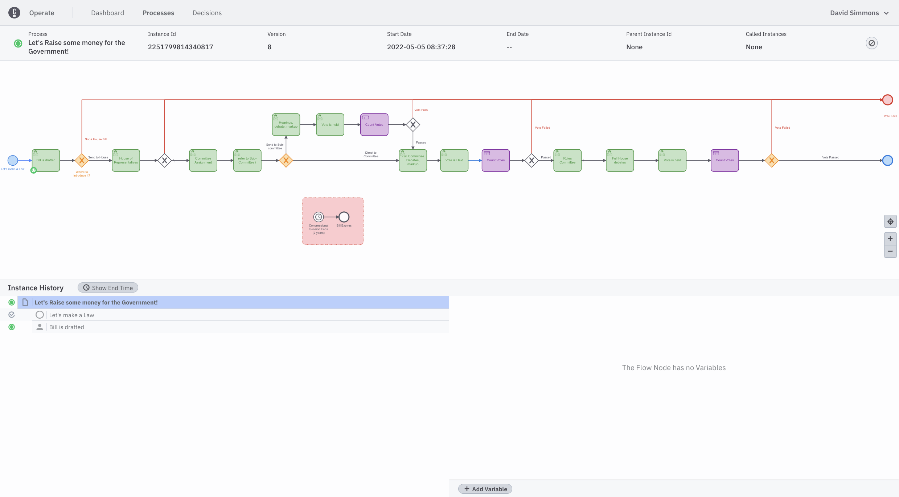

You can see the little green dot that indicates where in the process we are. The first thing we have to do is decide if this bil belongs in the House or the Senate. This is where the User Task comes in. I designed a form for this User Task where I ask one simple question: Is this bill an appropriations bill? Constitutionally, appropriations bills (those that will raise money) can *only* be introduced in the House.

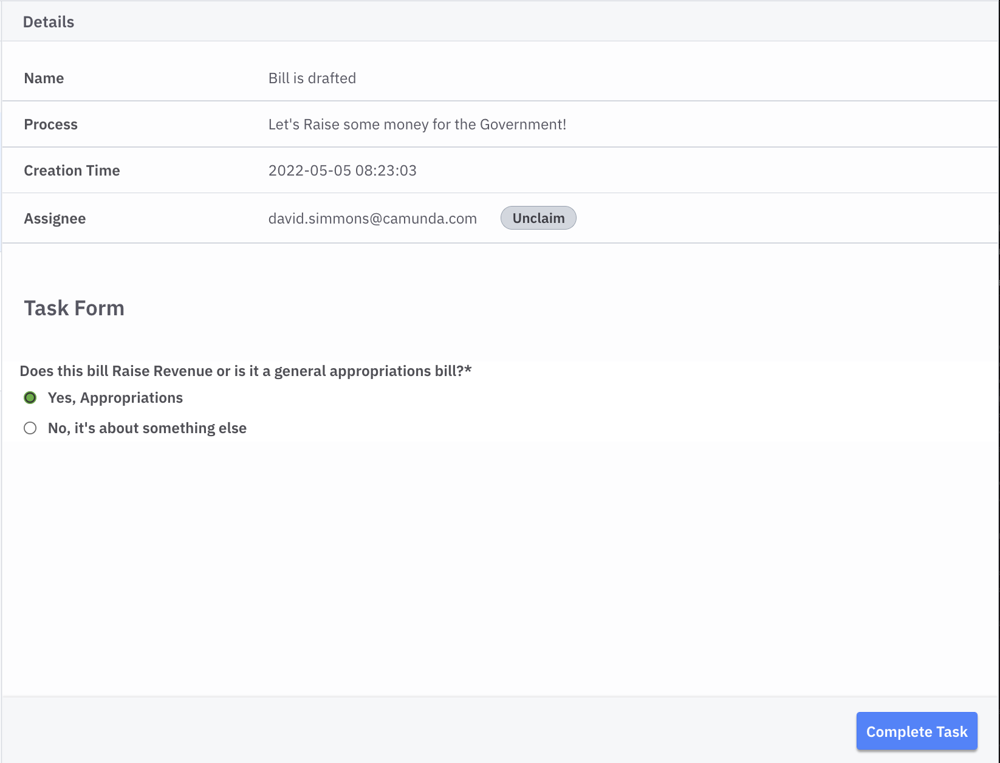

If you look at the process above, you'll figure out that if I were to say `no` here the process would end, as this process only looks at how bills are introduced in the House. _Technically_ this is incorrect, as _any_ bill can be introduced in the House, but I did this to show how the process could work.

Next we will decide if the House will accept the bill. There are many reasons that the House may reject a bill from being poorly written, to there not being enough time to introduce it, etc. In our Form, however, we just give it a straight up or down decision.

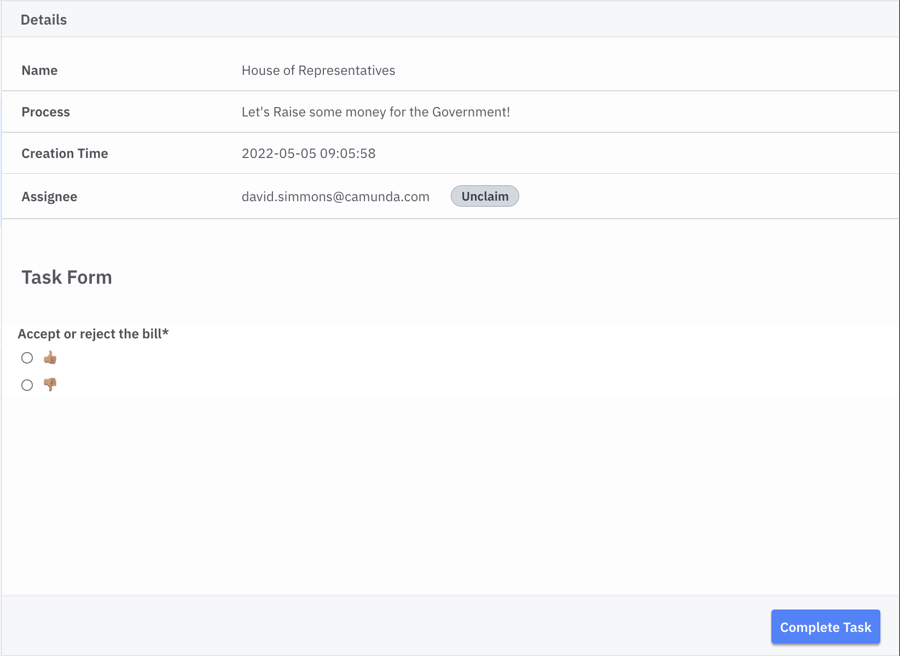

Notice that in Form Designer I can use emojis to make the form more fun. Congress could probably use more fun!

Once the Bill is accepted, it is assigned to a Committee for discussion, markup and an initial vote.

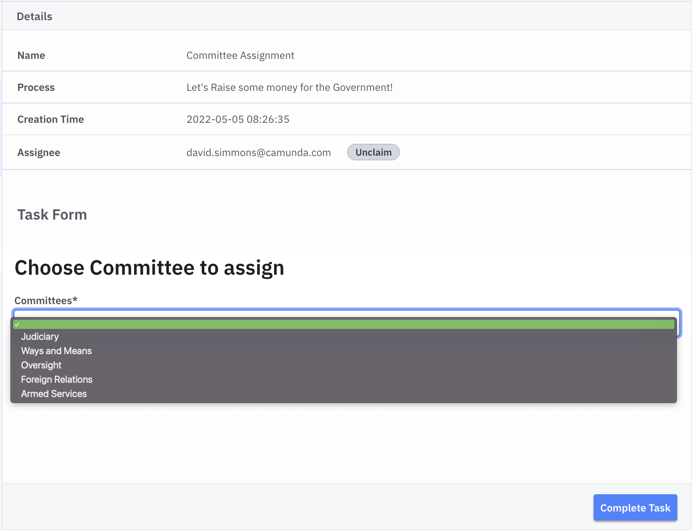

There are a *lot* more committees in the House, but I decided to keep the list manageable for this example. Once the Bill is sent to a committee, the committee decided whether or not top send the bill to a sub-committee for initial debate and markup.

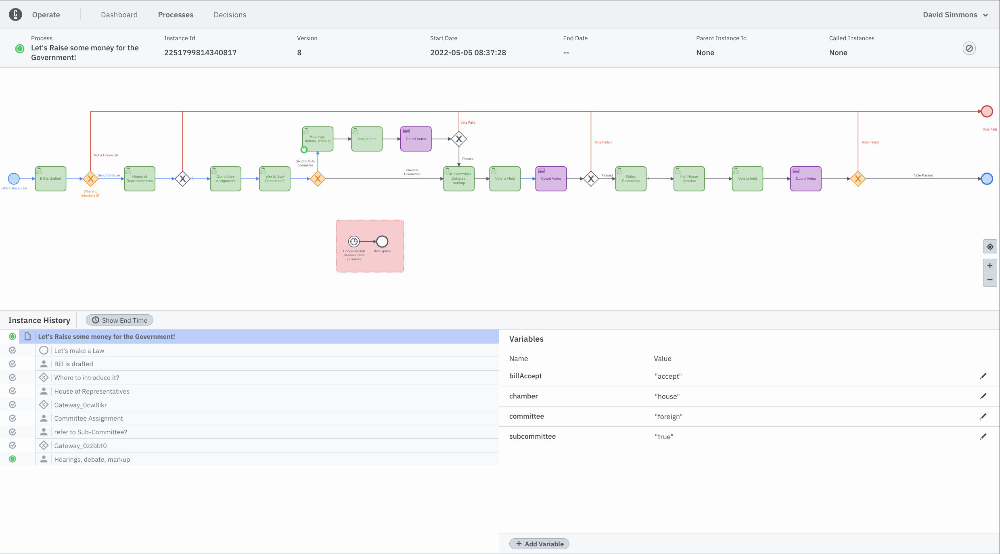

Once the Bill is sent to a sub-committee, that sub-committee reads through the Bill, makes any changes to it, and then takes a vote on whether or not to pass it along to the full committee.

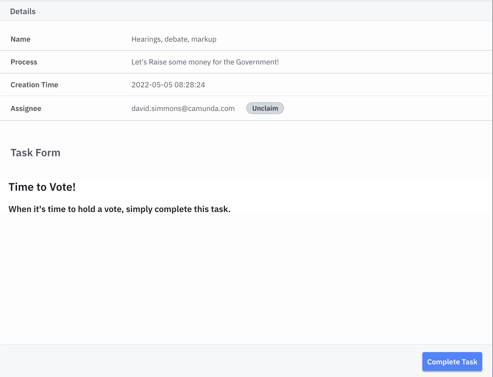

When the vote is called, all committee members have a chance to vote "Aye" or "Nay" as to whether the bill should be passed out of the sub-committee.

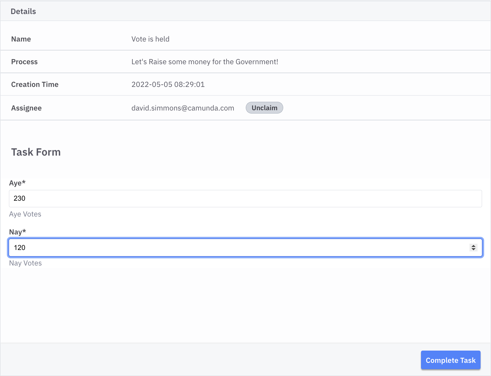

And a vote is held

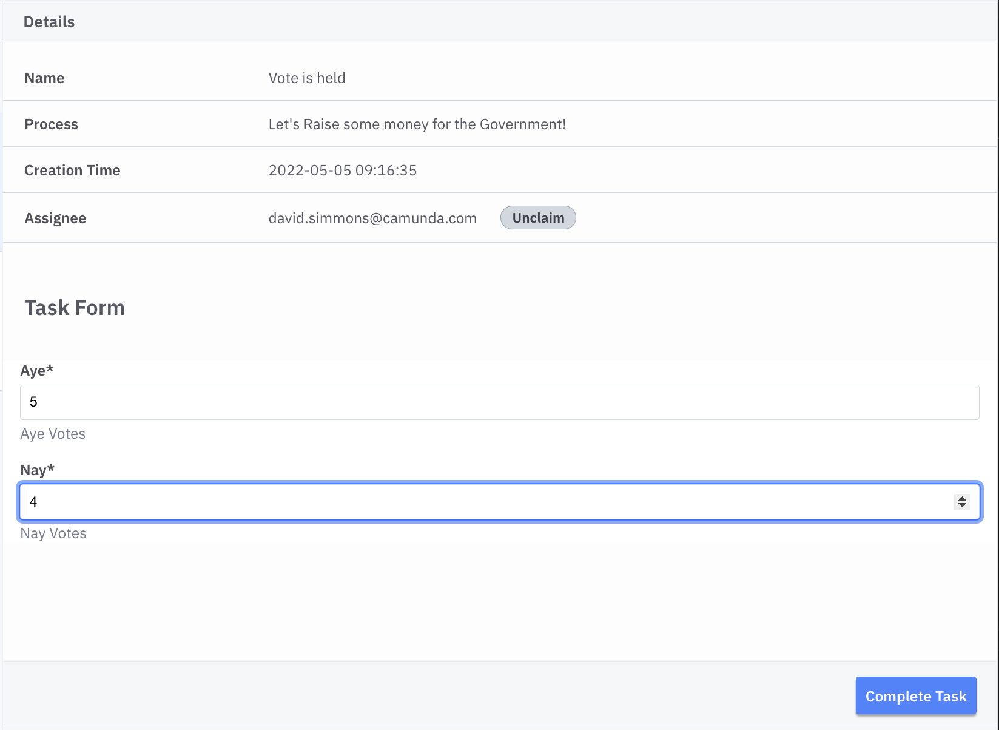

Once the votes are collected, we use a DMN decision table to decide whether or not the bill has carried.

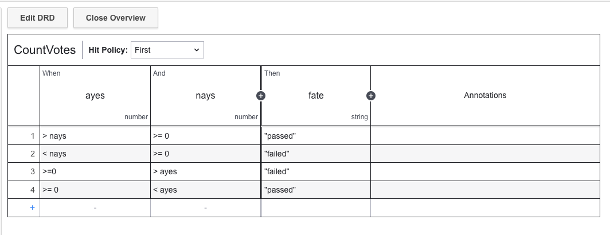

I was overly-thorough in this decision table, but I had to keep in mind that I was dealing with politicians, so I had to make sure I covered every possible outcome. The table takes the "ayes" and "nays" from the vote tally and decides whether or not the bill should be passed. If it failed, the process ends here, but we are going to move it along.

By using a decision table I can alleviate any accusations of vote-rigging shenanigans since no person has to make the decision, and the rules for the decision are clearly outlined in the table.

If we go back to Operate and look at the task and its progression, we can see that the bill bas passed out of the sub-committee and now sits with the entire committee. We can also see all the history of the bill so far.

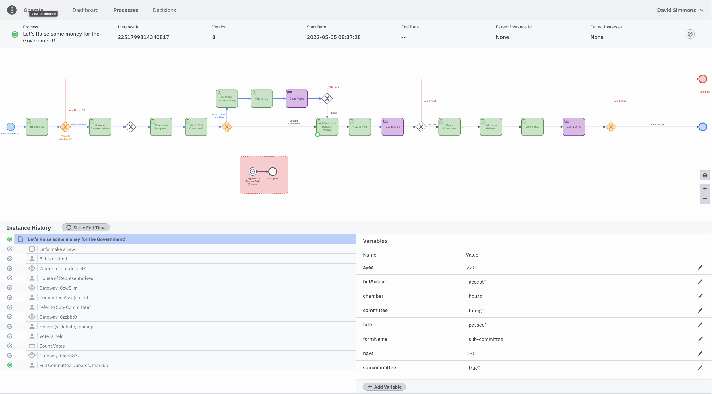

Again, by having all of the history of all the decisions made, and votes taken, we can easily track how the bill has progressed along the way.

We are not going to go through every step in the process here, since the rest of the steps are basically repetitions of steps we've already looked at.

One thing to note is that, since each of the following steps is largely the same as previous steps, I was able to re-use some of the forms and components I had already designed. I re-used the "Time for a Vote" task, the "Vote Tally" task and the vote counting decision table. This ability to reuse previously designed elements is a huge benefit to the process.

Finally, after the entire process is done (and the Bill has passed the House) we can look back at the path that the bill followed.

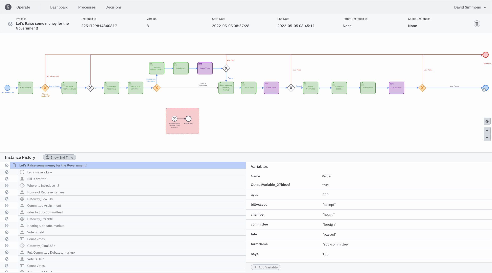

You can see that the path the Bill followed is colored blue so at any time we can go back, find the exact Bill we are interested in, and see all of the history associated with it including the path it took through the House.

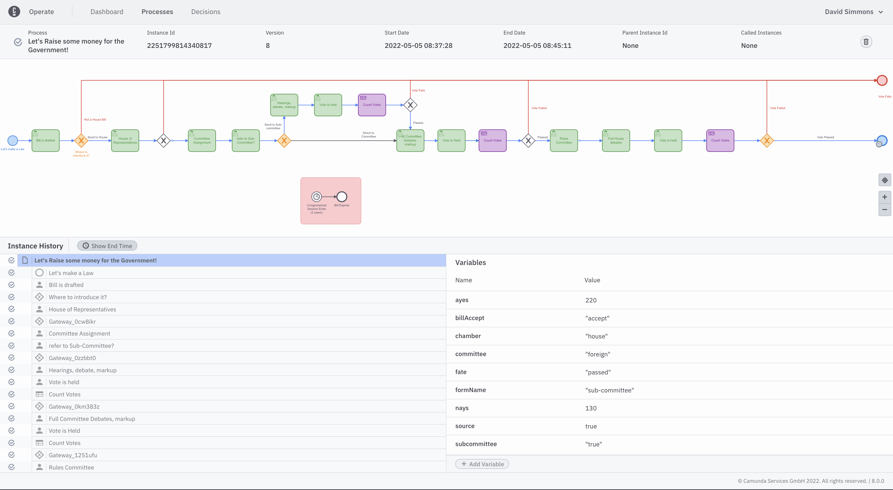

## Wait, there's something else there!

You've probably seen and been wondering about this little sub-task that's been hanging around the whole time.

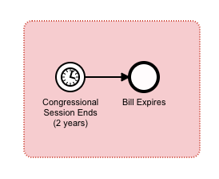

In the US Congress, a Bill can only be considered in the Congress in which it was introduced. We hold elections for the House of Representatives every 2 years, which is the length of time that a Bill can be considered in the House. If a Bill has not either passed or been rejected by the House during this time, it 'expires' with the ending of that Congress.

So, in order to ensure that all the active Bills are *only* considered during that time, we have an expiration timer for all bills. This sub process has a timer that expires after 2 years. If the timer goes off, the Bill is considered expired and is no longer considered in the House.

## Conclusions

We have now mapped out the entire process for getting a Bill through the US House of Representatives. Although I started out this post showing you a couple of flowcharts for how the process worked, those were just flowcharts. I couldn't actually execute them as a process. By using Camunda Platform 8 to model the process in BPMN I was able to transform it into an actual executable process. By adding forms, using the integrated Form Builder, I was able to add easy human interactions to the process, and by using a small DMN Decision Table if removed (hopefully) any chance of error in counting the votes and deciding if the Bill passed or failed.

So what's missing? Well, this is just a small part of the overall process for turning a Bill into a Law. The entire process is repeated over in the Senate (with a few changes). If the Bill passess both houses, but one or the other made changes, the Bill has to go to a Conference Committee where the changes are reconciled so that the two versions match exactly. On'ce *that's* done, the Bill goes on to the President for his signature (or a veto).

If anyone's interested in seeing the rest of the process developed please reach out to [me](mailto:david.simmons@camunda.com) and let me know. Or feel free to check out the [source code](https://github.com/davidgs.com/law-blog) and make any additions or changes as a pull request.

It won't make Congress any more efficient, but maybe it'll make us all feel better knowing that it *could* be.
